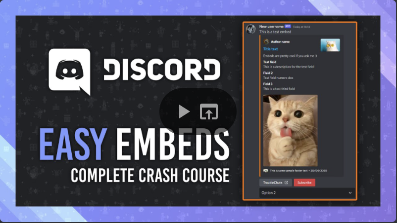

# Embed Generator

[](https://github.com/merlinfuchs/embed-generator/releases)
[](https://hub.docker.com/r/merlintor/embed-generator)

A powerful tool for creating rich-embed Discord messages using webhooks.

You will usually want to use the hosted version at https://message.style. There is not much benefit in hosting this
yourself.

## YouTube tutorial

[](https://www.youtube.com/watch?v=DnFP0MRJPIg)

## Self Hosting

This describes the easiest way to self host an instance of Embed Generator by creating a single binary that contains
both the backend and frontend.

You can find prebuilt binaries of the server with the frontend files included [here](https://github.com/merlinfuchs/embed-generator/releases/latest).

### Build the app (frontend)

You can download NodeJS and NPM from [nodejs.org](https://nodejs.org/en/download/).

```sh
# Switch to the embedg-app directory
cd embedg-app

# Install yarn globally
npm install -g yarn

# Install dependencies
yarn install

# Start the development server (optional)
yarn dev

# Build for production use
yarn build
```

### Build the server (backend)

Install Go from [go.dev](https://go.dev/doc/install).

```sh
# Switch to the backend directory
cd embedg-server
# or if you are in the frontend directoy
cd ../embedg-server

# Start the development server (optional)
go run main.go server

# Build and include the frontend files in the backend binary
go build
```

Before you can start the server you must have built the frontend atleast once. Otherwise the server won't start!

### Install databases

Install PostgresQL on your device and create a user and database. I'm sure you can find instructions online!

### Configure the server

To configure the server you can create a file called `config.yaml` with the following fields:

```yaml
development: true

discord:
  client_id: ""
  client_secret: ""
  token: ""

openai:
  api_key: "" # for ChatGPT integration (optional)

postgres:
  host: "localhost"
  port: 5432
  dbname: "embedg"
  user: "postgres"
  password: ""

app:
  public_url: "http://localhost:5173/app"
  server_static: true # Set to false if you don't want the serve the frontend files (you will need a HTTP server like Nginx to host it instead)

api:
  public_url: "http://localhost:5173/api"
  host: "localhost"
  port: 8080
```

You can also set the config values using environment variables. For example `EMBEDG_DISCORD__TOKEN` will set the discord
token.

### Run the binary

You should now be able to run the binary and host your own instance of Embed Generator. You usually want to deploy this
behind a reverse proxy like Nginx and terminate TLS there.
