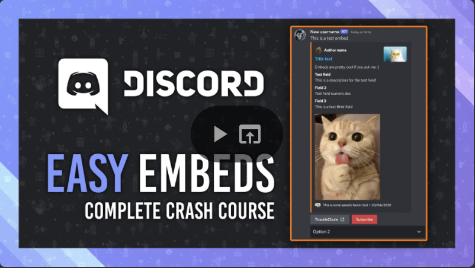

# Embed Generator

[](https://github.com/merlinfuchs/embed-generator/releases)
[](https://hub.docker.com/r/merlintor/embed-generator)

[](https://github.com/merlinfuchs/embed-generator/releases/latest)
[](LICENSE)
[](https://status.message.style/)
[](https://message.style/discord)

A powerful tool for creating rich-embed Discord messages using webhooks.

You will usually want to use the hosted version at https://message.style. There is not much benefit in hosting this
yourself.

## YouTube tutorial

[](https://www.youtube.com/watch?v=DnFP0MRJPIg)

## Self Hosting

This describes the easiest way to self host an instance of Embed Generator by creating a single binary that contains
both the backend and frontend.

You can find prebuilt binaries of the server with the frontend files included [here](https://github.com/merlinfuchs/embed-generator/releases/latest).

### Configure the server

Copy [`embedg.example.toml`](embedg.example.toml) to `embedg.toml` next to the binary and fill in the Discord
credentials. To keep the config somewhere else, pass `--config <path>`
(`embedg-server server --config /etc/embedg/embedg.toml`) or set `EMBEDG_CONFIG`.

To run several instances, give them all the same `shard_count` and tell each one which slice to
take with `instance_count` and `instance_index`, which is the only value that differs between
them:

```toml
[discord]
shard_count = 250
instance_count = 5
instance_index = 0   # 1, 2, 3, 4 on the others; EMBEDG_DISCORD__INSTANCE_INDEX works too
```

Instance `i` of `n` runs every `n`-th shard, so together they cover every shard exactly once even
when the count doesn't divide evenly. Instance 0 holds shard 0 and runs the work that happens once
per deployment rather than once per guild. `shard_ids` is still there for an irregular split.

The S3 credentials are required; image uploads go there. The docker-compose setup below runs MinIO for it.

You can also set the config values using environment variables, with `__` between the sections. For example
`EMBEDG_DISCORD__TOKEN` sets the Discord token and `EMBEDG_DATABASE__POSTGRES__HOST` the Postgres host.

### Migrating from older versions

Upgrading from v0.6 or older? An existing `config.yaml` still loads but is deprecated. See
[MIGRATION.md](MIGRATION.md) for converting it and the other changes.

### Using Docker (docker-compose)

Install Docker and docker-compose and create a `docker-compose.yaml` file with the following contents:

```yaml
version: "3.8"

services:
  postgres:
    image: postgres
    restart: always
    volumes:
      - embedg-local-postgres:/var/lib/postgresql/data
    environment:
      POSTGRES_USER: postgres
      POSTGRES_DB: embedg
      PGUSER: postgres
      PGDATA: /var/lib/postgresql/data/pgdata
      POSTGRES_HOST_AUTH_METHOD: trust
    healthcheck:
      test: ["CMD", "pg_isready"]
      interval: 3s
      timeout: 30s
      retries: 3

  minio:
    image: quay.io/minio/minio
    command: server --console-address ":9001" /data
    ports:
      - "9000:9000"
      - "9001:9001"
    environment:
      MINIO_ROOT_USER: embedg
      MINIO_ROOT_PASSWORD: 1234567890
    volumes:
      - embedg-local-minio:/data

  embedg:
    image: merlintor/embed-generator:latest
    restart: always
    ports:
      - "8080:8080"
    environment:
      - EMBEDG_API__HOST=0.0.0.0
      - EMBEDG_API__INSECURE_COOKIES=true
      - EMBEDG_DATABASE__POSTGRES__HOST=postgres
      - EMBEDG_DATABASE__POSTGRES__USER=postgres
      - EMBEDG_DATABASE__POSTGRES__DB_NAME=embedg
      - EMBEDG_DATABASE__S3__ENDPOINT=minio:9000
      - EMBEDG_API__PUBLIC_URL=http://localhost:8080/api
      - EMBEDG_APP__PUBLIC_URL=http://localhost:8080/app
    volumes:
      - ./embedg.toml:/root/embedg.toml
    depends_on:
      postgres:
        condition: service_healthy

volumes:
  embedg-local-postgres:
  embedg-local-minio:
```

Run the file using `docker-compose up`. It will automatically mount the `embedg.toml` file into the container. You should not configure postgres in your config file as it's using the postgres instance from the container.

Embed Generator should now be accessible in your browser at [http://localhost:8080](http://localhost:8080).

### Build from source

#### Build the app

You can download NodeJS and NPM from [nodejs.org](https://nodejs.org/en/download/).

```sh
# Switch to the embedg-app directory
cd embedg-app

# Enable pnpm (Corepack ships with NodeJS)
corepack enable

# Install dependencies
pnpm install

# Start the development server (optional)
pnpm dev

# Build for production use
pnpm build
```

#### Build the site (home page & docs)

```sh
# Switch to the embedg-app directory
cd embedg-site

# Enable pnpm (Corepack ships with NodeJS)
corepack enable

# Install dependencies
pnpm install

# Start the development server (optional)
pnpm start

# Build for production use
pnpm build
```

#### Run the databases

`docker-compose.dev.yaml` in the repository root starts Postgres and MinIO and nothing else, so the
service itself runs from source against them:

```sh
docker compose -f docker-compose.dev.yaml up -d
```

The credentials match the defaults in `embedg-server/config/default.toml`, so `embedg.toml` only
needs the Discord section. MinIO creates its buckets on startup. If you'd rather install Postgres
yourself, create a `postgres` user and an `embedg` database.

#### Build the server (backend)

Install Go `>=1.25` from [go.dev](https://go.dev/doc/install).

```sh
# Switch to the backend directory
cd embedg-server
# or if you are in the frontend directoy
cd ../embedg-server

# Configure the server (see steps below)

# Run database migrations
go run main.go migrate postgres up

# Start the development server (optional)
go run --tags "embedapp embedsite" main.go server

# Build and include the frontend files in the backend binary (build app and site first)
go build -o embedg-server --tags "embedapp embedsite"

# Build without including the frontend files in the backend binary (you need to serve yourself)
go build -o embedg-server
```

#### Run the binary

You should now be able to run the binary and host your own instance of Embed Generator. You usually want to deploy this
behind a reverse proxy like Nginx and terminate TLS there.
