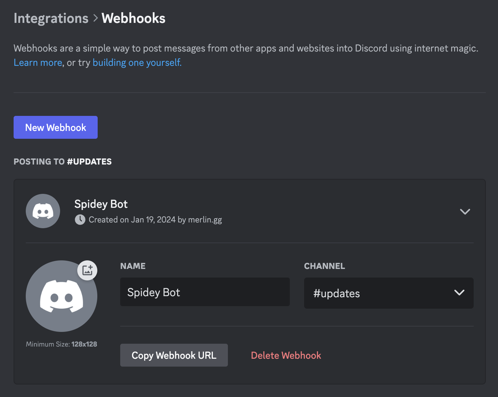
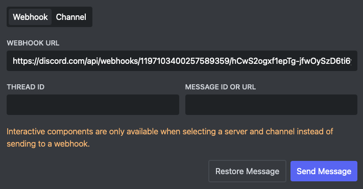
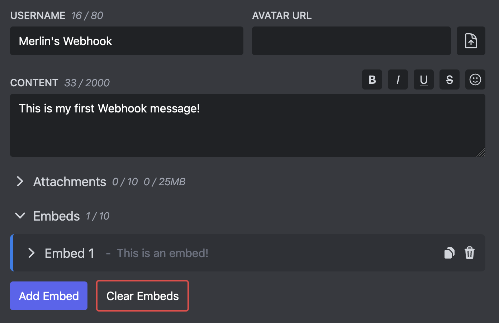
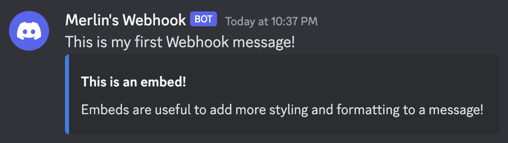

Discord Webhooks are a powerful feature which allows Discord server administrators to generate a unique URL which can be used by third party services to send messages to a Discord channel.

Discord is not the only platform that supports webhooks. They are commonly used by platforms to receive updates and notifications from third party services that integrate with them. These third party services just have to know the webhook URL and the format that is expected to send messages programmatically.

Webhooks on Discord are unique in the sense that they are not only used programmatically by third party services to send updates. Many people use Discord webhooks to send out messages by hand instead of sending them with their own Discord account because webhook messages have way more formatting options than normal messages.

This is why there are tools like [Embed Generator](https://message.style) that can help you sending messages through Discord webhooks.

<!--truncate-->

## Creating a Webhook

Creating a Webhook is pretty easy as long as you have the "Manage Webhooks" permissions in the channel that you want to create a Webhook for. Just go into the channel settings and select "Integrations" on the left and click on "Create Webhook".  
Click on the newly created Webhook to change it's name, set and avatar and copy the webhook URL. **Anyone that has the URL can send a message to the channel**, so keep it secret!



## Getting Information about Webhook

Sometimes you might have the URL for a Webhook but don't actually know where it comes from or which Webhook it belongs to. This is way it can be handy to know how to extract information from a Webhook URL.

To get information about a Webhook you can simply paste its URL into your browser. You will get a JSON (JavaScript Object Notation) response which contains information about your Webhook. Most of the information aren't very helpful without some knowledge about the Discord API, but you will at least be able to see the name of your Webhook!

```js
{
  "application_id": null,
  "avatar": null,
  "channel_id": "1177278388516421783",
  "guild_id": "730045476459642900",
  "id": "1197983293228982302",
  "name": "Spidey Bot",
  "type": 1,
  "token": "...",
  "url": "https://discord.com/api/webhooks/..."
}
```

## Sending a Webhok Message

Now the interesting part, how do we actually send a message with a Webhook?  
Usually sending a Webhook message requires programming skills or at least some technology knowledge. Luckily there are tools like [Embed Generator](https://message.style) that make it trivial to send a Webhook message without programming skills!

### Paste in the Webhook URL

Open the [message editor of Embed Generator](https://message.style/app) and click on "Webhook" at the top to indicate that you want to send the message to a Webhook.

Now paste in the Webhook URL that you got after the creating the Webhook into the "Webhook URL" field.



### Create Your Message

Now you can start creating your message. Embed Generator gives you a lot of options to style your message.

First you can set the username and avatar which you can use to override the avatar and name you gave to the Webhook. For every message you send you can set a custom username and avatar!

Now you can add some text to your message by filling out the Content field. Embed Generator provides you with some a useful toolbar to format your message and add emojis to it.

Lastly you can also add embeds to your message. These are like separate content blocks that support more styling options like adding a title, custom fields, and images.



### Send Your Message

Once you are happy with your message you can send the message to your Webhook my clicking on "Send Message" at the top of the page.

This is it! You have created your first Webhook message!


