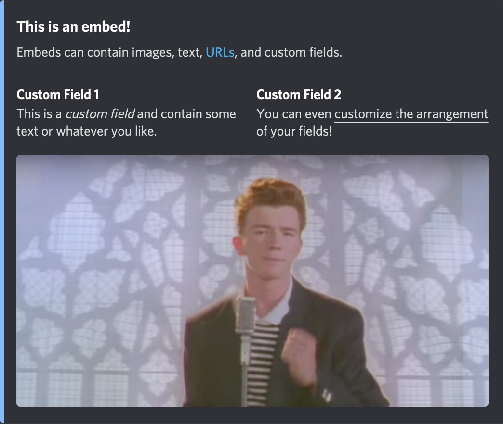
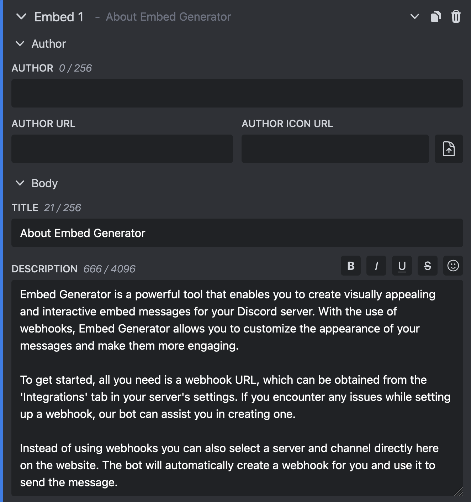
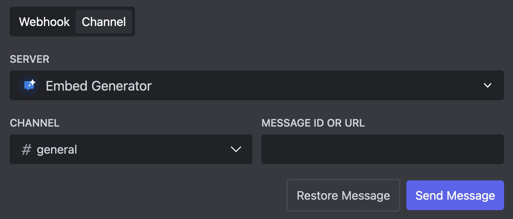
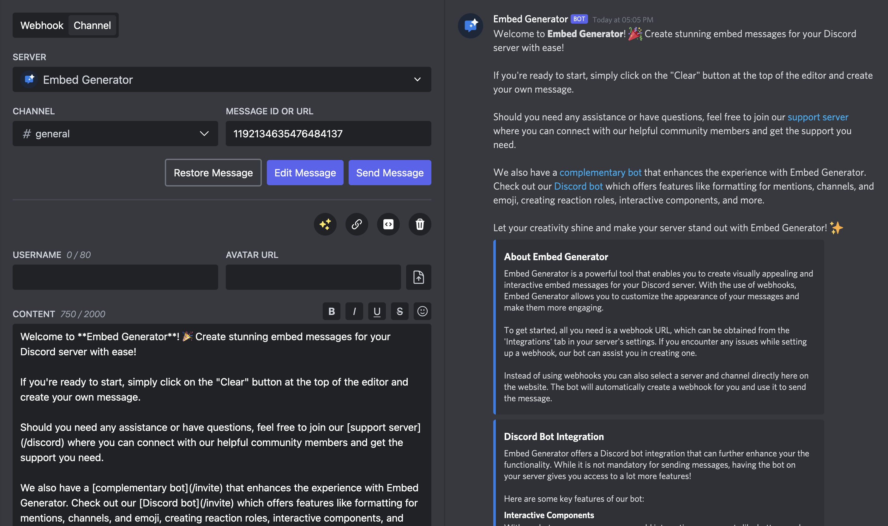
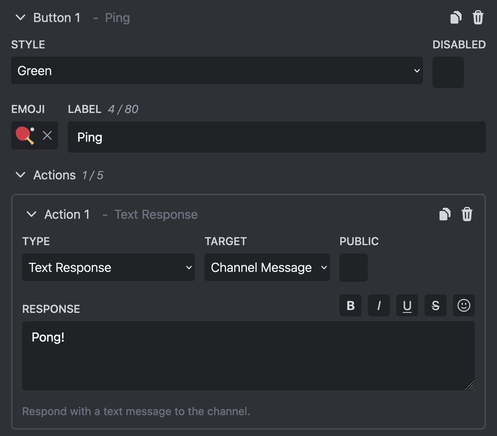

Discohook is a popular tool for creating Discord embed messages using Webhooks. Sadly it's not perfect ...
For many features an additional bot is needed and the setup can be confusing. Additionally the uptime has been far from perfect recently.

TLDR: [Embed Generator](https://message.style) is the superior alternative to Discohook in terms of features, usability, and stability.

<!--truncate-->

## Overview of Discohook

Discohook is an open source service that allows users to create good looking embed messages for their Discord server.

Discord embed messages are commonly used by Discord server owners to make their announcement messages look better and give them a bit more strucutre. Without external tools like Discohook the formatting of messages in Discord is quite limited.

To send these messages Discohook uses so called Webhooks. Discord allows server owner to create Webhooks for their channels which can then be copied into tools Discohook to send a message to that channel. While Webhooks are good for many purposes they are no very beginner friendly and also lack some important features.

Discohook lets users create "backups" of their messages which they can restore at a later point. This way users can work on multiple messages without loosing progress. These message backups are sadly only stored locally and are not synchronized across the devices of the user. Sometimes they are even deleted when the user clears their browser cache.

While the most basic features of Discohook are easily accessible through their website, for more advanced features like scheduled messages and interactive components you have to leave their website and invite a third party bot or even install a browser extension.

## The need for a Discohook alternative

Discohook is a great service for creating Discord embed messages and it's understandable that many users like it. It allows designing and structuring Discord messages in a way that isn't possible out of the box with Discord.

Sadly Discohook hasn't seen any active development in the last fear years and is falling behind the competition. It lacks support for newer Discord features and is only really suitable for static messages.

While you can use other third party services to augment the features of Discohook to add support for interactive components and scheduled messages, this isn't user or beginner friendly at all.

In the last few months Discohook has experienced an increasing amount of downtime. Users weren't able to access the website, send messages or access their backups. While this is certainly not a good sign, we understand the difficulties of financing a service purely with donations.

This is why there is a need for a good Discohook alternative that is actively maintained, user friendly, and supports all of the important features out of the box.

## Introducing Embed Generator

[Embed Generator](https://message.style) is an open source alternative to Discohook. It is actively maintained by a competent team with over 6 years of experience in the Discord space and supports all the important features out of the box.

All of the features like embeds, interactive components, scheduled messages, and custom commands are available through an easy to use web interface and don't require any third party services or complex integrations.

All features of Discohook and even more advanced features like interactive components and scheduled messages are available for free using Embed Generator. While you can subscribe to Embed Generator Premium to get the most out of it and support the development, it's completely optional.

### Visual Engaging Embeds

Embed Generator allows you take advantage of all Discord embed features, including titles, images, custom fields, and even having multiple embeds per message. In additional to embeds you can add file attachments and interactive componenets.

### User-Friendly Interface

All features are available through a user-friendly web interface. It's all in one place, you never have to leave the site to some other third party service to get all the features.

### No Webhook URLs

While you can still manually create Webhooks and use the Webhook URL to send the message, with Embed Generator there is an easier way to do it. Simply select the server and channel where you want to send the message and our bot will handle the rest. You can still change the username and avatar!

### Real-Time Preview

While you are working on your message you don't want to constantly check Discord to see how it will look like in the end. Embed Generator has a live preview built in which matches the Discord UI as close as possible.

### Interactive Components

Adding interactive components to your message is easier than ever with Embed Generator! Simply add a button or select menu in the message editor and define what you want to happen when a user interacts with it.

### Scheduled Messages

You want to send your message at an exact point in time and can't do it yourself? Embed Generator can send your messages at a pre-defined time for you!

### Custom Commands

Messages aren't enough and you want more ways for users to interact with Embed Generator? Just add your own commands to Embed Generator or even add your own bot with a custom username and avatar!

## Conclusion

Discohook is good solution if you are looking for basic way to create Discord embed messages. As soon as you want more possibilities Discohook becomes increasingly hard to use.

Embed Generator on the hand has everything you need builtin and is easy to use for beginners and also offers all the features for more advanced use cases. Embed Generator's emphasis on rich and dynamic embeds, a user-friendly interface, real-time previews, extensive customization options, and the inclusion of interactive components positions it as a superior alternative to Discohook. As Discord users strive to create engaging and visually stunning environments for their communities, Embed Generator emerges as a powerful tool that unlocks the full potential of embeds, taking Discord integration to new heights.

[Get started with Embed Generator now!](https://message.style)
