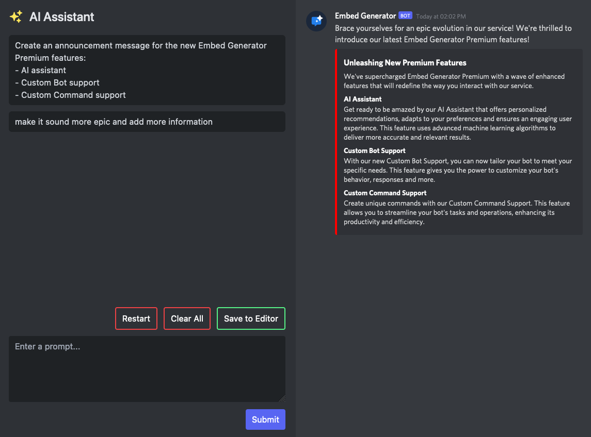

# ⭐ AI Assistant

With Embed Generator Premium you get an AI assistant inside the editor. Describe the message you want in a sentence, for example "welcome message for a gaming server with rules and a role button", and the assistant drafts the whole thing: content, embeds, fields and colors.

Open it with the **AI Assistant** button in the editor menu bar. The draft lands in the editor like any other message, so you can change wording, swap images, add components and send or save it as usual.

