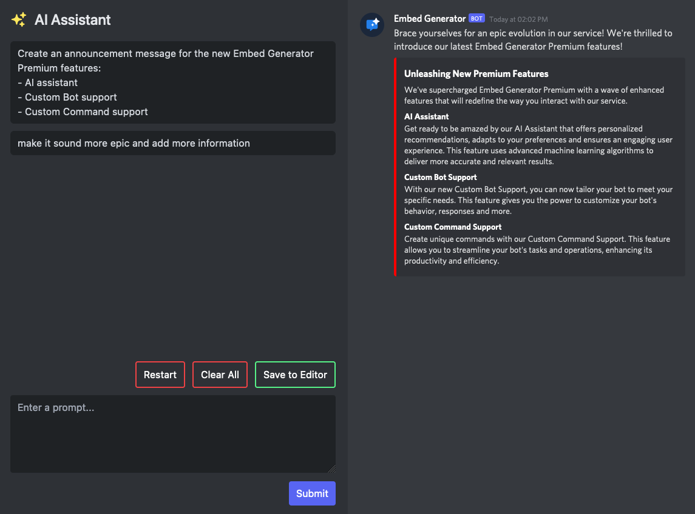

# AI Assistant

The AI assistant builds messages for you in a chat next to the editor. Describe what you want, for example "welcome message for a gaming server with the rules and a button that gives the Member role", and it builds the whole thing: content, embeds, components v2 layouts, buttons, select menus and their actions.

Open it with the **AI Assistant** button in the editor menu bar after selecting a server. It knows the roles, emoji and saved messages of that server, so it can set up role buttons and saved message responses for you. When it needs something only you know, like a channel, it asks with a small form.

Changes land in the editor right away. You can keep editing them by hand, undo them, or ask the assistant for more changes. Nothing is sent until you send it.

Every server gets a few prompts each month for free, and [Embed Generator Premium](../premium) raises the limit. Only requests that change the message count. Questions, answers where the assistant asks you something, and fixes of its own mistakes are free.

