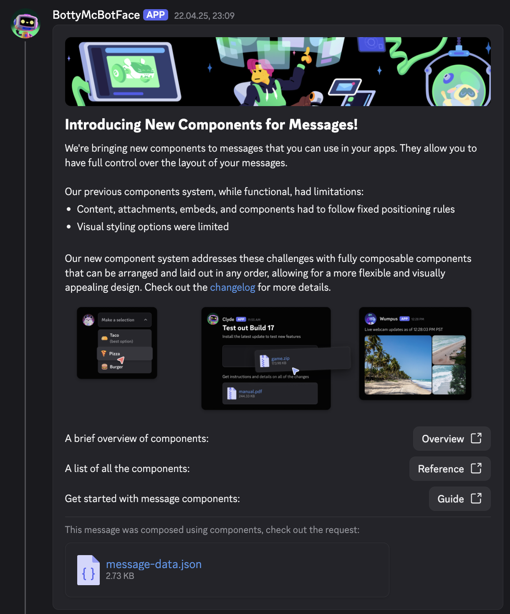
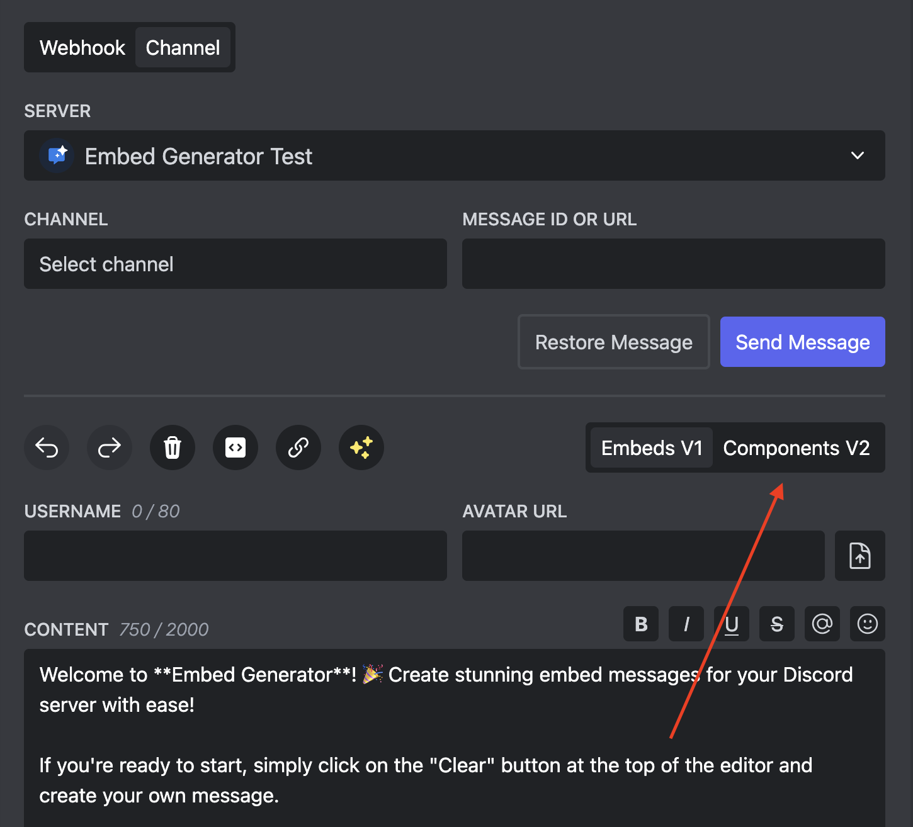

# Components V2

Embed Generator has experimental support for Discord's new Components V2. They replace regular embeds and can't be mixed with them.

With Components V2 you have more control over the look and feel of your messages. You can now add separators, multiple columns, images, and more.

**⭐ Some components are currently only available with Embed Generator Premium.**

## Enable Components V2

To enable Components V2, click on the "Components V2" button in the editor menu bar. This will remove all existing data from the editor.

You can also disable Components V2 by clicking on the "Components V2" button again. This will again remove all existing data from the editor.
