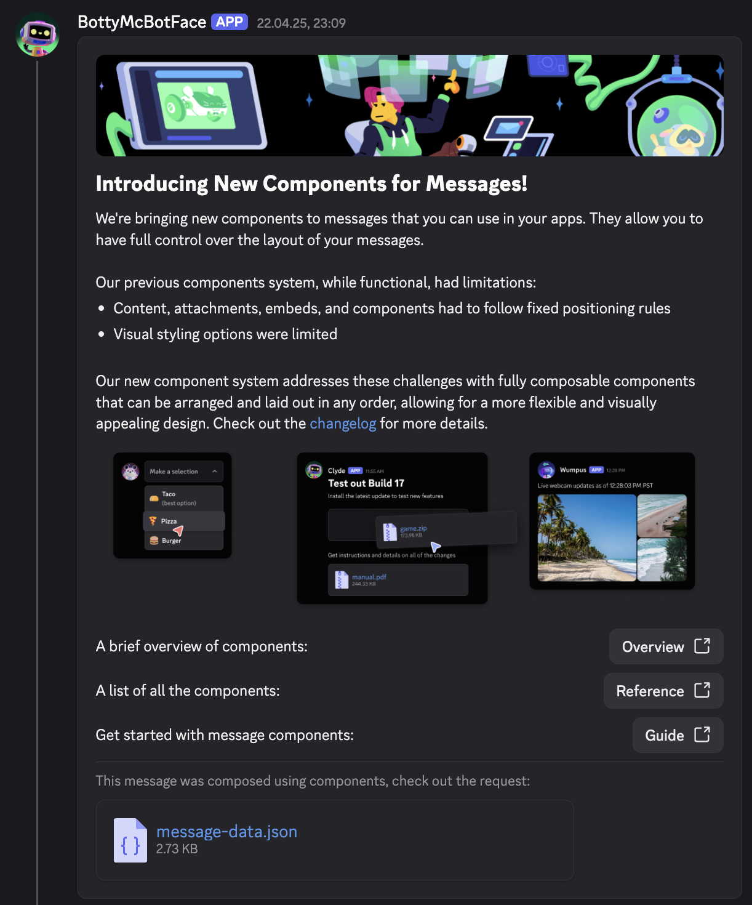
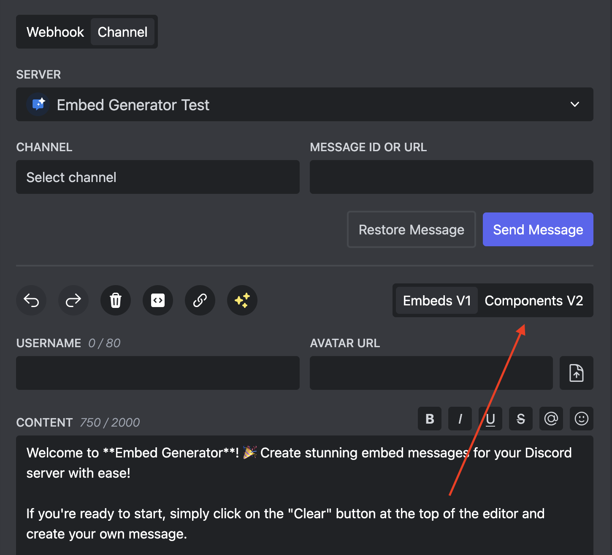

# Components V2

Components V2 is Discord's newer message layout system. Instead of one text block plus embeds, a message is built from layout components you stack and nest, which gives you much more control over how it looks. Embed Generator supports it in the editor with a live preview.

Components V2 replaces regular embeds. A message uses one or the other, not both.

:::info Premium
Some Components V2 components are only available with [Embed Generator Premium](../premium).
:::

## What you can build with it

- **Container**: a box with an optional accent color on the left, similar to an embed, that holds other components.
- **Section**: a block of text with an optional accessory on the right, either a thumbnail image or a button.
- **Text display**: a paragraph of markdown text. Use several to structure longer messages.
- **Separator**: a horizontal divider with adjustable spacing to break the message into parts.
- **Media gallery**: up to ten images or videos shown as a grid.
- **File**: an attached file shown inline.
- **Action rows**: buttons and select menus, the same [interactive components](../guides/interactive-components) you know from regular messages.

A typical announcement is a container with a section for the headline and a thumbnail, a separator, a text display with the details, and an action row with a button.

## Enable Components V2

To enable Components V2, click on the "Components V2" button in the editor menu bar. This will remove all existing data from the editor.

You can also disable Components V2 by clicking on the "Components V2" button again. This will again remove all existing data from the editor.

## Things to know

- Components V2 messages can be sent through webhooks and through the bot.
- Saved messages, scheduled messages and custom command responses all work with Components V2.
- Older Discord clients may render these messages slightly differently, so check the preview on mobile and desktop for important posts.
