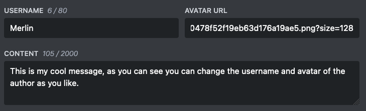
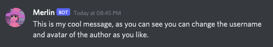

# Custom Branding

Embed Generator lets you change the username and avatar of the messages you send. Set both at the top of the editor and the message shows up in Discord under that name with that picture, with the small **App** badge next to it.

This works for every message sent through a webhook. Each message can use a different name and avatar, so one webhook can post as "Mod Team" today and "Event Bot" tomorrow.

Replies to buttons and select menus come from the bot that handles the interaction. If you want those to carry your own name and avatar too, connect your own bot with [White Label](./white-label).

