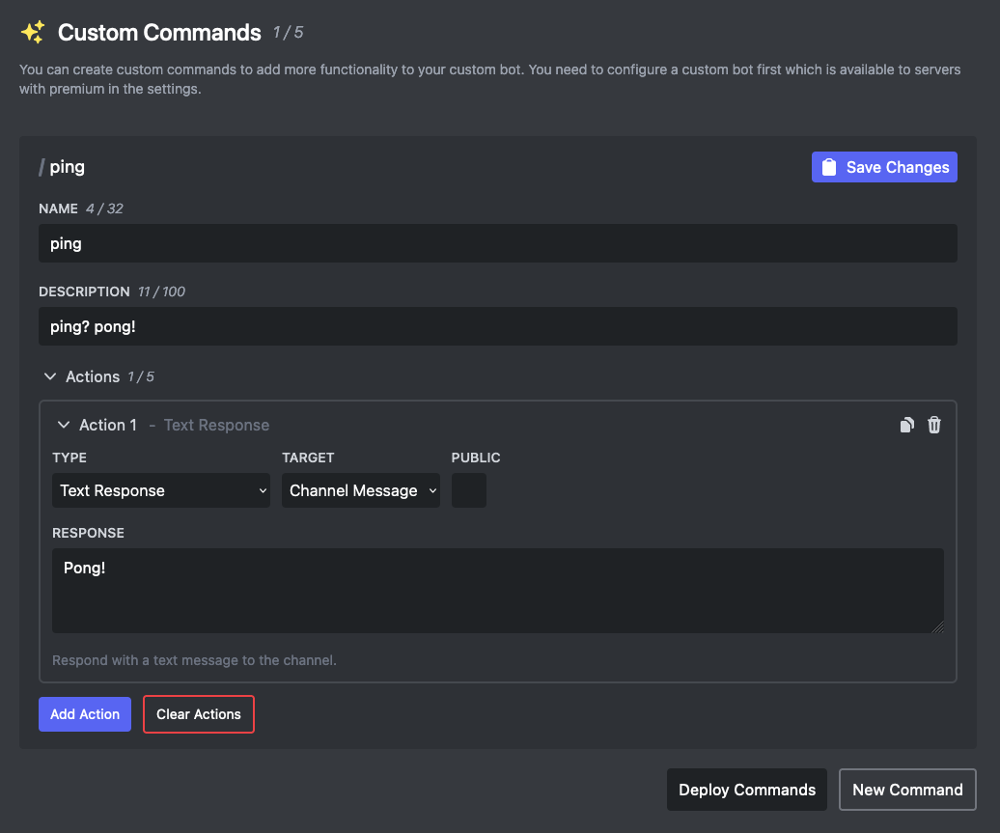

# ⭐ Custom Commands

With Embed Generator Premium you can add your own slash commands to your server. A command has a name, an optional description and arguments, and a list of actions that run when a member uses it: reply with a text or saved message, add or remove roles, or a combination.

Commands run through your own bot, so they need [White Label](./white-label) set up first. Combined with [message variables](../guides/variables) you can build things like `/profile` commands that show the member's name and join date, or `/rules` that posts your saved rules message.

Read the full guide on [creating commands](../guides/custom-commands).
