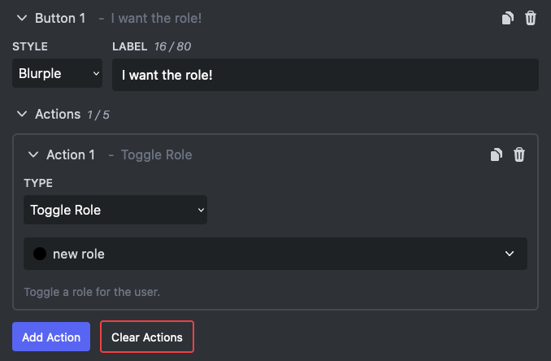

# Interactive Components

Interactive components are buttons and select menus attached to your message. Each one can run actions when a member clicks it: hand out or remove roles, reply with a text or saved message, or open a link.

Components need the Embed Generator bot on your server, because the bot is what receives the click. Log in, pick a channel as the target instead of a webhook, and the **Components** section appears at the bottom of the editor. Up to 5 rows of buttons or select menus per message.

Limits: 2 actions per component for free, 5 with [Premium](../premium).

Read the full guide on [buttons, select menus and actions](../guides/interactive-components).
