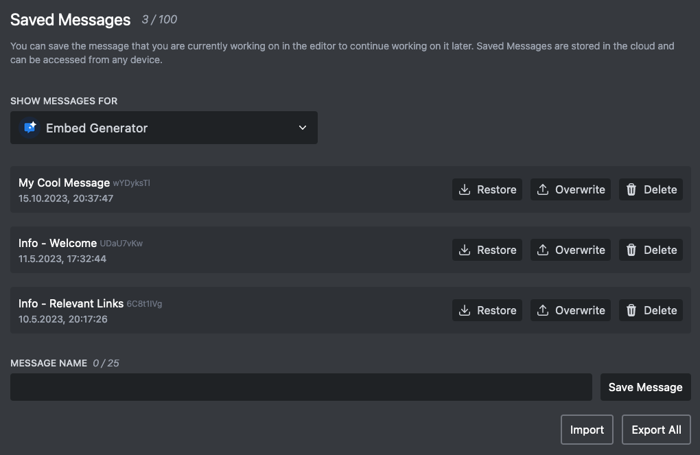

# Save Messages

Embed Generator stores your messages in the cloud so you can come back to them from any device. Log in with your Discord account, click **Save** in the editor, give the message a name, and it shows up under **Saved Messages**.

You can save a message to your own account or to one of your servers. Messages saved to a server are visible to every admin of that server, which makes it easy to share templates for rules, announcements or event posts with your team.

Saved messages are also what [scheduled messages](../guides/scheduled-messages), [custom commands](../guides/custom-commands) and the saved message response of [interactive components](../guides/interactive-components) run on, so anything you want to send more than once should be saved first.

Limits: 25 saved messages for free, 100 with [Premium](../premium).

