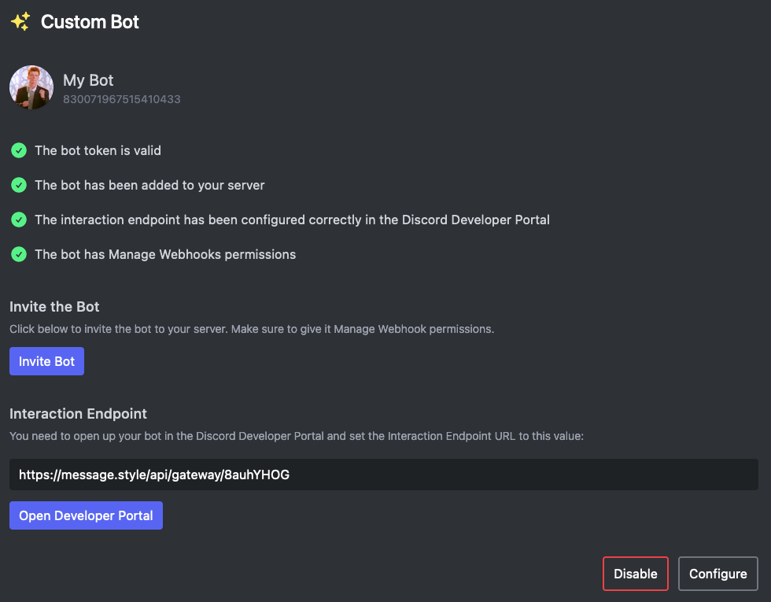

# White Label

Premium

With Embed Generator Premium you can connect your own Discord bot. Once it is set up, replies to buttons and select menus, and any [custom commands](./custom-commands), come from your bot with its name, avatar and status. Your members never see Embed Generator.

You create the bot in the Discord Developer Portal, paste its token into the Embed Generator settings, invite it to your server and point its interaction endpoint at Embed Generator. The whole setup takes a few minutes and is covered step by step in the guide.

Read the full guide on [setting up a custom bot](../guides/custom-bots).
