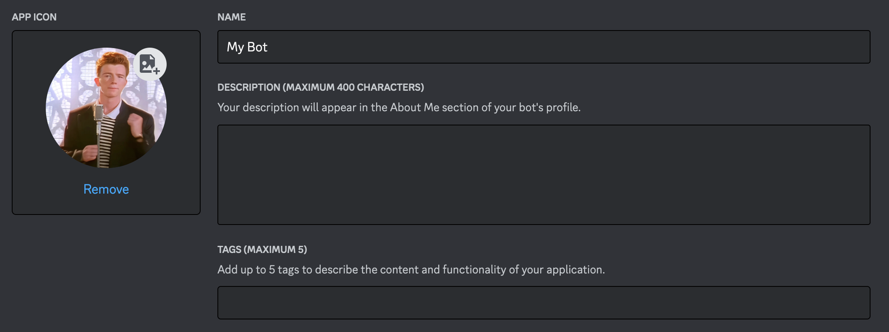
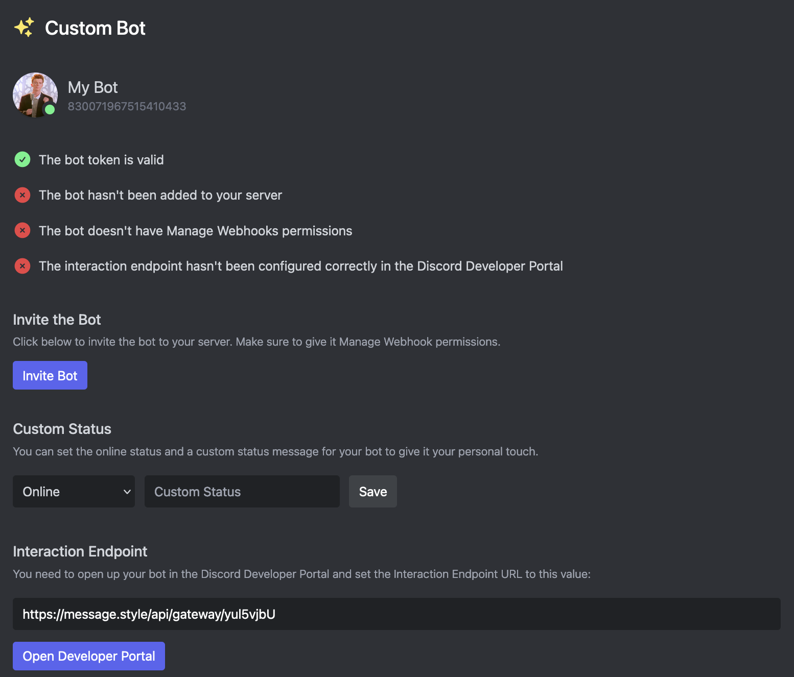

# Custom Bots

Custom Bots allow you to change the username and avatar for interactive component responses and make it appear in your member list.

This feature is only available to [Embed Generator Premium](../premium) subscribers.

## Adding Your Custom Bot

Adding a Custom Bot to Embed Generator is pretty easy and usually only takes a few minutes.

### Create a Discord Application

You first have to create an Application in the [Discord Developer Portal](https://discord.com/developers/applications) which can then be added to Embed Generator.

Click on "New Application" and give your Application a name. This is the username that will later be visible to your members. You will now see a page where you can change the Icon of your application. This is the avatar that will later be visible to your members. You can also give your Application a description which will be visible on the user profile of your Custom Bot.

Once you are happy with the appearance of Custom Bot continue by clicking on "Bot" on the left side of the screen. Here you can grab the token for your Application by clicking on "Reset Token". Once you have the token you are done on Discord Developer Portal and you can go back to the [Settings page](https://message.style/app/settings) on message.style.

### Adding The Custom Bot

You will now be prompted to input your Bot Token. This is the token you got from the Discord Developer Portal in the previous step. Once you pasted in your token and clicked on "Save" your Custom Bot should appear.

You will see a few tasks that have to be done before your Custom Bot can be used.

### Inviting The Custom Bot

First you have to invite the Custom Bot to your Discord server. You can easily do that by clicking on the "Invite Bot" button. Make sure to keep the "Manage Webhooks" and "Manage Roles" permissions selected for your Custom Bot to work properly.

### Setting The Interaction Endpoint

For your Custom Bot to be able to respond to your [Custom Commands](./custom-commands) and [Interactive Components](./interactive-components) you must configure the Interaction Endpoint in the Discord Developer Portal.

Simply clopy the URL that is displayed to your and click on the "Open Developer Portal" button. Once you are on the Discord Developer Portal scroll down a bit, paste the URL into the Interaction Endpoint URL field and click on "Save Changes".

Once all of this is done your Custom Bot should work and will be used to respond to Custom Commands and interactive components on all messages that are **created after adding the Custom Bot**.

### Setting a Custom Status

For even most customizability you can set a Custom Status for your Custom Bot. You can select a status (e.g. online or Do Not Disturb) and set a status message that will appear in the member list on your server.

## Caveats & Limitations

- You have to keep the Embed Generator bot on your server even if you have a Custom Bot configured
- Once you add a Custom Bot you won't be able to update messages that have been created before adding the Custom Bot
- Responses to [Interactive Components](./interactive-components) will only use the Custom Bot if they have been created after the Custom Bot has been added
