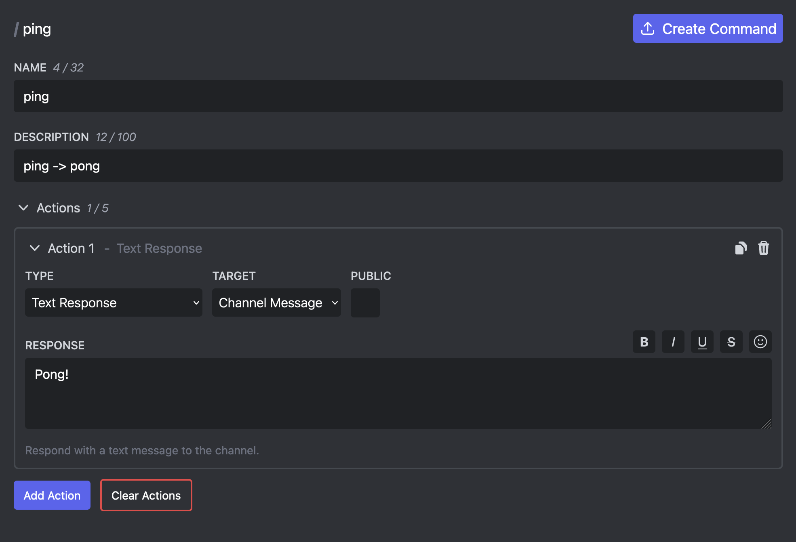

# Custom Commands

Custom Commands allow you to add your own commands to your Custom Bot which can be used by members of your server by typing `/`. They can have arguments, respond with messages, or assign roles to members.

This feature is only available to [Embed Generator Premium](../premium) subscribers.

## Setting Up Your Custom Bot

Before you can create Custom Commands you have to setup your Custom Bot. [Follow the guide](./custom-bots) for that first before continuing here!

## Creating Your First Command

To create your first Custom Command go to the [Commands page](https://message.style/app/commands) and click on "New Command".

You can input a name and description for your command. The name is used by your members to run the command (e.g. `/my-command`) and the description is displayed below the name.

After you have decided a name and description for your command you can now add actions to it. These actions define what happens when a user runs the command. There are different types of actions for creating text responses, responding with saved messages, or assigning roles. See [Interactive Components](./interactive-components#actions) for more information.

Once you are happy with your command you can click on "Create Command" to save it. You will notice that your command is not yet available on your server. To change that you have to click on "Deploy Commands" at the bottom right.

## Caveats & Limitations

### Commands Names

There are a few limitations for command names. If clicking on the "Deploy Commands" button fails, it's likely that you have invalid command names.

First of all commands can only contain latin characters and must not be longer than 100 characters.

Embed Generator supports 3 levels of commands: root commands, sub command groups, and sub commands.
You can create sub command groups & sub commands by adding a space to your command name (e.g. `/info user`) and you can have multiple sub commands on the same root command or sub command group (e.g. `/info user` + `/info server`). What you can't do is have the root command as its own command and additionally a sub command (e.g. `/info` + `/info user`).

### Command Arguments

You can add arguments to your Custom Commands which your members must fill out when they are running the command. These arguments can be used as [message variables](./variables) in your response messages.

### Command Actions

You can have to up to 5 actions for each command.
