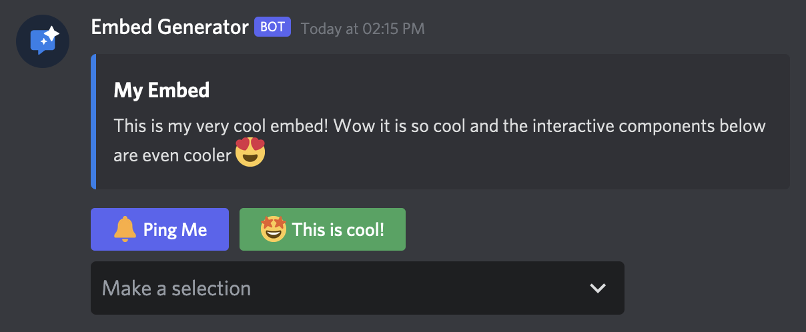
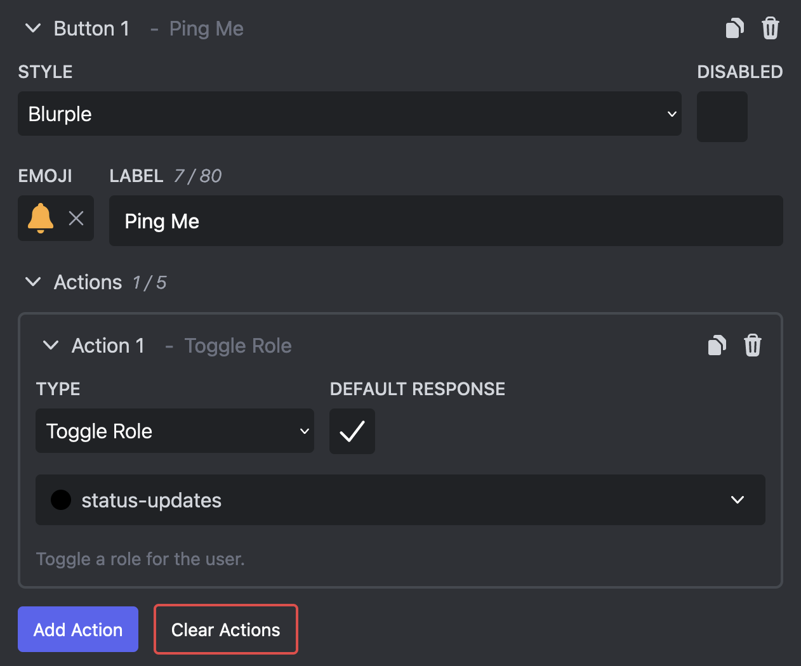
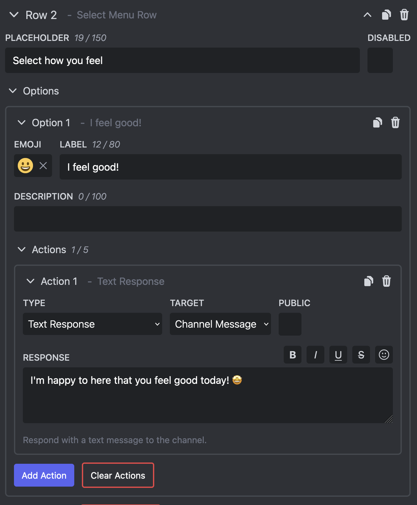
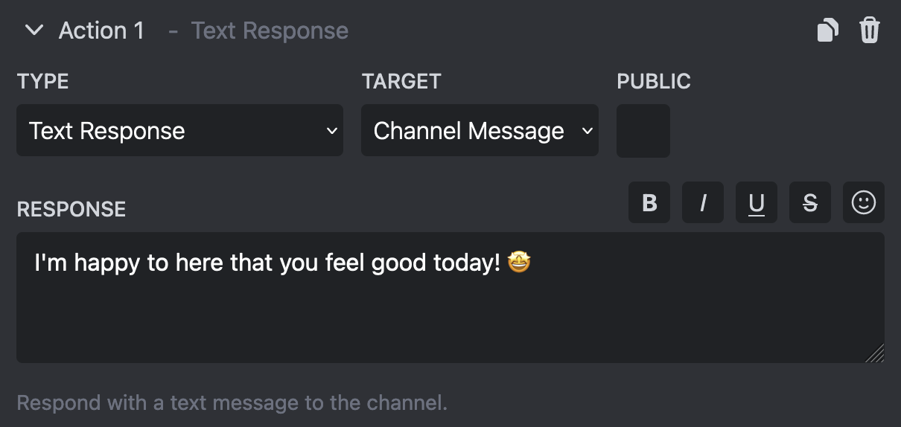
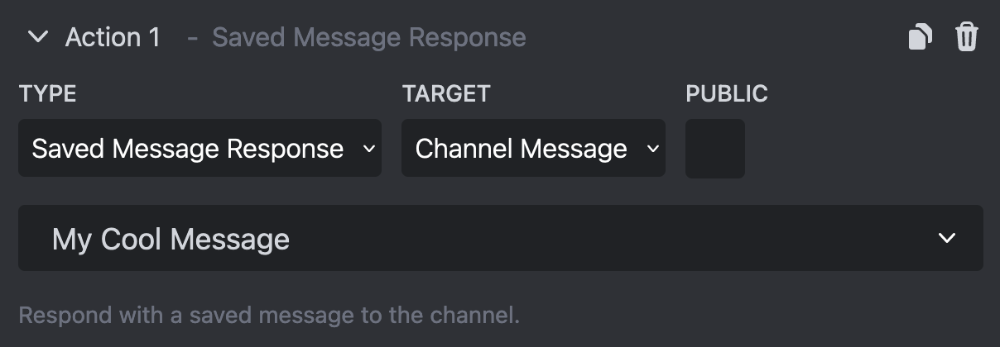
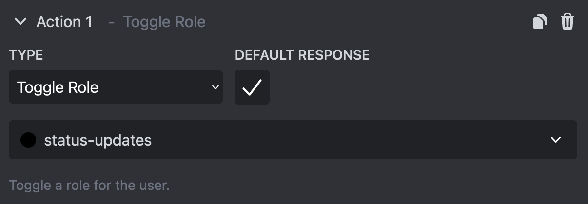

# Interactive Components

Interactive Components can be added to your messages to allow users to interact with them. Right now there two types of Interactive Components: buttons & select menus.

Interactive Components are only available after logging in and selecting a channel. They aren't available when sending to a Webhook directly. The option can be found at the very button of the message editor.

## Buttons

Buttons are simplest way to make your messages interactive. You can have up to 5 button rows with 5 buttons each which makes for a maximum number of 25 buttons that can be added to a message.

There are different Styles for buttons. The first 4 styles just change the color and appearance of your button, but the last one is special. Use the "Link" button style to make a direct link to a Website or any of the other button styles if you want to respond with a message or assign roles.

A button must have a label which is displayed to the user and can optionally have an emoji which is displayed next to the label. If you want to have a button that is purely there for design purposes but isn't interactive, select the "Disabled" option.

If you have select the "Link" style you have to input an URL that the button will link to. Otherwise you can add a number of [Actions](#actions) to your button. These are used to respond to interactions or assign roles to the user.

## Select Menus

Select menues are a bit more complex and work similar to a dropdown menu. You can add up to 5 select menus to your message and each select menu takes the space of one button row (5 buttons).

You can set a "Placeholer" for your select menu which is more or less the equivalent of the label for a button. If you don't set a placeholder a generic text "Make a selection" will be displayed.

Each select menu can have up to 25 options. These options are what your users will be able to select from the dropdown. Each option must have a label and can optionally have a description below the label and an emoji next to it.

Additionally you can add a number of [Actions](#actions). These are used to respond to interactions or assign roles to the user when they select the option.

## Actions

Actions define what happens when a user interacts with your components or runs one of your [custom commands](./custom-commands).

Normally you can add 2 actions to each of your components, but [Embed Generator Premium](../premium) subscribers can add up to 5!

### Text Response

This action will create a simple text response. You can select if the message should be visible to everyone in the channel (select "Public") or only to the that has interacted with the component or has ran the command.

You can also select where the message should be send. By default a new message will be created in the channel where the user has interacted with the components or ran the command, but you can also select to send a direct message to the user or even edit the message.

### Saved Message Response

This action will create a response message from a saved message.

You can create a saved message by creating a message in the editor and the going to your [Saved Messages](https://message.style/app/messages), setting a name and clicking on "Save Message". Make sure to select the server at the top where you want to be able to use the saved message in a response!

Once you have selected the message that you want to respond with you can select if you want to create a public response and how the message should be send. This works the same as for text responses above.

### Add, Remove, or Toggle Roles

These actions let you assign roles to the user that has interacted with the components or ran the command.

Embed Generator will only be able to assign roles that they have the necessary permissions for. Make sure that the "Embed Generator" role is above all the roles that you want Embed Generator to assign and make sure it has "Manage Roles" permissions.  
If you have a [Custom Bot](./custom-bots) configured make sure it also has the necessary permissions.

By default Embed Generator will send a text response to the user to indicate that a role has been addeed or removed. If you don't want to have custom response instead unselect the "Default Response" options.

