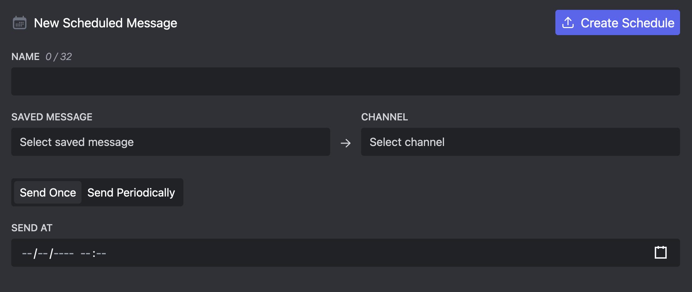
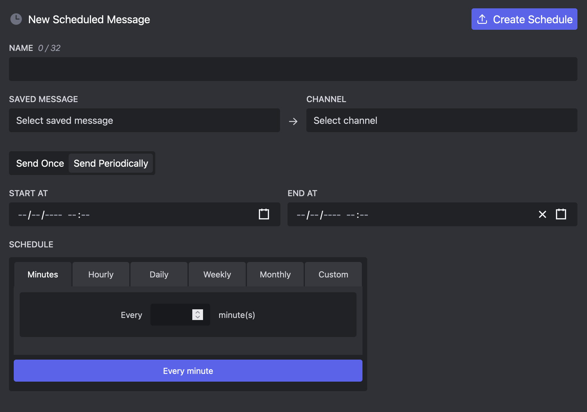

# Scheduled Messages

Scheduled Messages let you scheduled messages to be send at a later point. This way you can define an exact point in time where your message will be send.

## Send Once

Usually you want your message to be send once at a specific time. Just select the saved message, the target channel, and a time and give your scheduled message a name.

Make sure there are no errors in the selected message, otherwise the message will not be send.

## Send Periodically

You can also select messages to be send periodically, so every hour, day or week.

This feature is only available to [Embed Generator Premium](../premium) subscribers.

