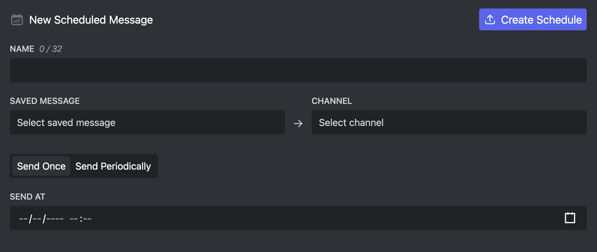
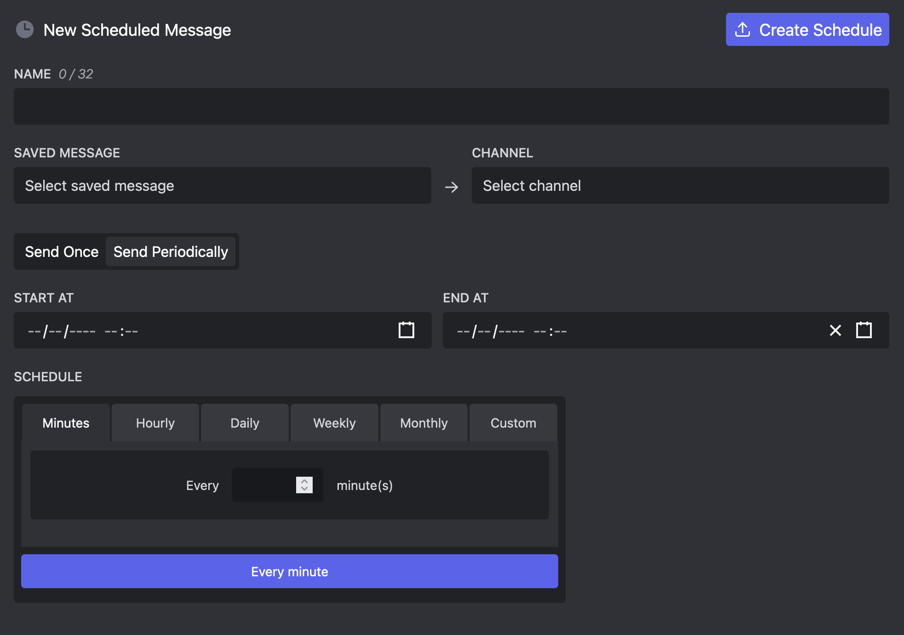

# Scheduled Messages

Scheduled Messages let you send a saved message at a later point in time. This way you can define an exact point in time where your message will be sent.

## Send Once

Usually you want your message to be sent once at a specific time. Just select the saved message, the target channel, and a time and give your scheduled message a name.

Make sure there are no errors in the selected message, otherwise the message will not be sent.

## Send Periodically

You can also select messages to be sent periodically, so every hour, day or week.

Sending a message once is free. Repeating schedules are only available to [Embed Generator Premium](../premium) subscribers.

## Timezone

All times of a scheduled message are in the timezone you select for it, which defaults to the timezone of your browser. Pick UTC if you'd rather enter times in UTC. Repeating schedules follow daylight saving time changes of their timezone, so a message sent every day at 9:00 stays at 9:00.
