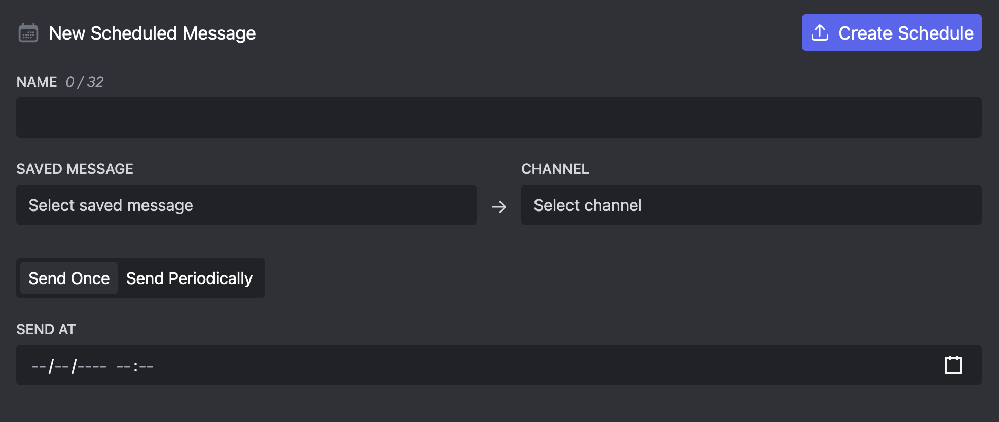
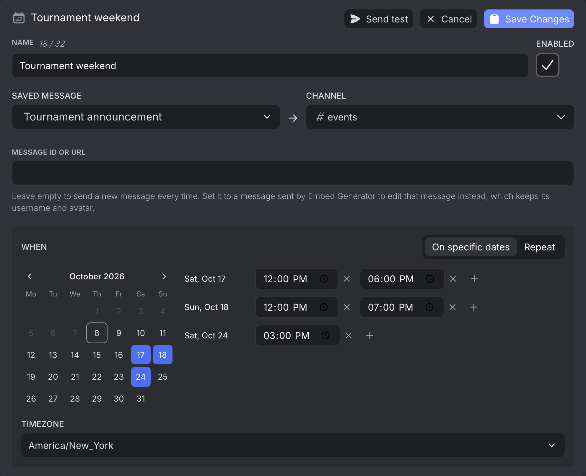
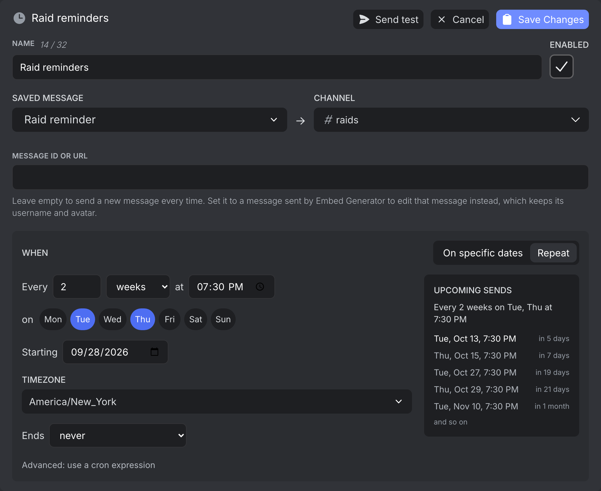
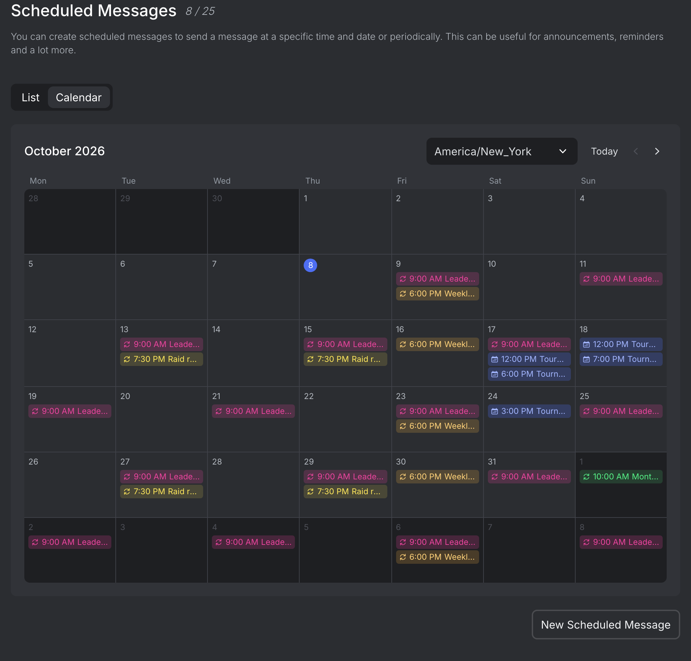
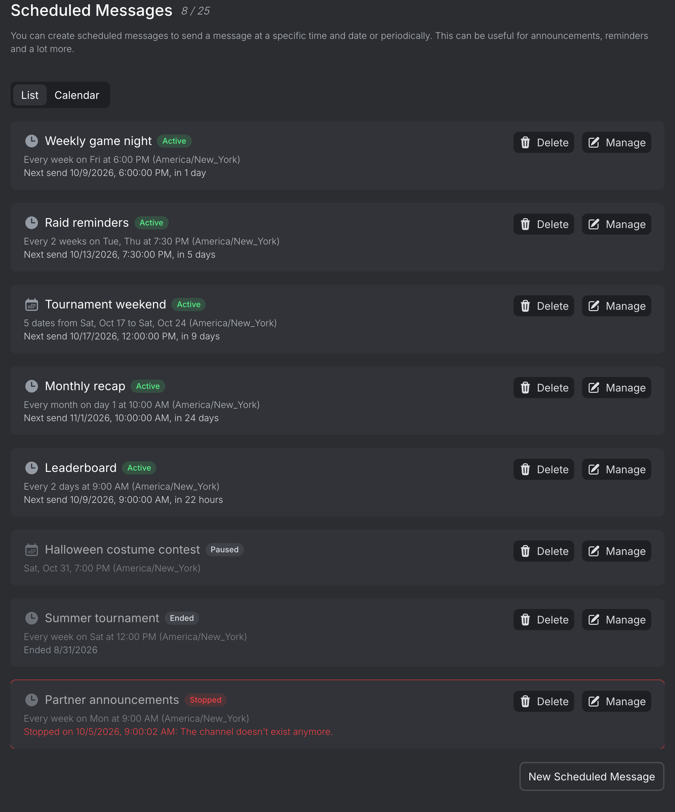

# Scheduled Messages

For an overview of what scheduled messages can do, see [Schedule Discord Messages](/features/scheduled-messages).

Scheduled Messages let you send a saved message at a later point in time. This way you can define an exact point in time where your message will be sent.

## Send Once

Usually you want your message to be sent once at a specific time. Just select the saved message, the target channel, and a time and give your scheduled message a name.

## Send on Several Dates

Pick more than one date to send the same message on each of them, like the days of an event. A day can have several times. The dates count as one scheduled message.

## Send Periodically

You can also repeat a message, like "every 2 weeks on Monday and Thursday at 18:00" or "every 3 months on the 1st at 12:00". The preview below the schedule lists the next sends, so you can check it does what you expect before saving. Counting starts at the first send on or after the start date. You can end the schedule on a date or after a number of sends.

With **Advanced: use a cron expression** you can enter a cron expression instead. A schedule can't send more than once a minute.

Sending on more than one date and repeating schedules are only available to [Embed Generator Premium](../premium) subscribers. Sending once is free.

## Calendar

The **Calendar** tab shows the upcoming sends of all scheduled messages of the server in one timezone. Click a send to open its scheduled message, or the plus on a day to schedule a new message on it.

## Checks and Errors

When you save, the saved message is checked for errors, so a broken message is caught before its first send. **Send test** sends it to the channel right away.

Each scheduled message in the list shows whether it's active, paused, ended or stopped. If a send fails, the message shows why and when. If Discord rejects the message, for example because the channel was deleted, the schedule stops instead of retrying forever.

## Timezone

All times of a scheduled message are in the timezone you select for it, which defaults to the timezone of your browser. Pick UTC if you'd rather enter times in UTC. Repeating schedules follow daylight saving time changes of their timezone, so a message sent every day at 9:00 stays at 9:00. A time the clocks skip, like 2:30 on the night they move forward, is sent when the clocks show 3:30 instead.
