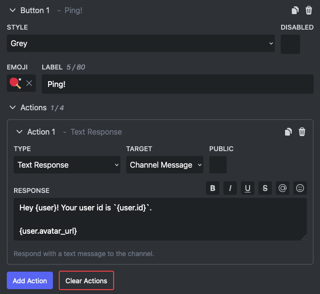
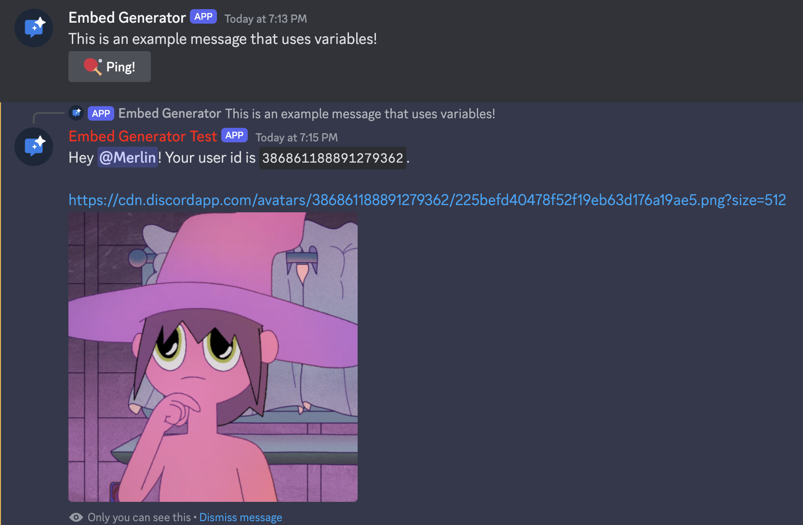

# Message Variables

Message variables are a way to dynamically adjust the content of your message based on the context. This is especially useful in responses to custom commands and interactive components.

To use a variable in your message just put `{{ .VariableName }}` where you want the value to appear. For example put `{{ .Interaction.User.Mention }}` in your message content to ping the user that has used a command.
Please notice the dot (`.`) in front of each variable name!




## List of Variables

| Variable                        | Type                                      | Description                                                                                                                                                                                                                     |
| ------------------------------- | ----------------------------------------- | ------------------------------------------------------------------------------------------------------------------------------------------------------------------------------------------------------------------------------- |
| .Interaction.User               | text                                      | Mention the user that has used the command or interactive component.                                                                                                                                                            |
| .Interaction.User.ID            | text                                      | The ID of the user that has used the command or interactive component.                                                                                                                                                          |
| .Interaction.User.Name          | text                                      | The display name or username of the user that has used the command or interactive component.                                                                                                                                    |
| .Interaction.User.Username      | text                                      | The username of the user that has used the command or interactive component.                                                                                                                                                    |
| .Interaction.User.Discriminator | text                                      | The discriminator of the user that has used the command or interactive component.                                                                                                                                               |
| .Interaction.User.Avatar        | text                                      | The avatar hash of the user that has used the command or interactive component.                                                                                                                                                 |
| .Interaction.User.AvatarURL     | text                                      | The avatar URL of the user that has used the command or interactive component.                                                                                                                                                  |
| .Interaction.User.GlobalName    | text                                      | The display name of the user that has used the command or interactive component.                                                                                                                                                |
| .Interaction.User.Mention       | text                                      | Mention the user that has used the command or interactive component.                                                                                                                                                            |
| .Server                         | text                                      | The name of the server where the command or interactive component has been used.                                                                                                                                                |
| .Server.ID                      | text                                      | The ID of the server where the command or interactive component has been used.                                                                                                                                                  |
| .Server.Name                    | text                                      | The name of the server where the command or interactive component has been used.                                                                                                                                                |
| .Server.Description             | text                                      | The description of the server where the command or interactive component has been used.                                                                                                                                         |
| .Server.Icon                    | text                                      | The icon hash of the server where the command or interactive component has been used.                                                                                                                                           |
| .Server.IconURL                 | text                                      | The icon URL of the server where the command or interactive component has been used.                                                                                                                                            |
| .Server.Banner                  | text                                      | The banner hash of the server where the command or interactive component has been used.                                                                                                                                         |
| .Server.BannerURL               | text                                      | The banner URL of the server where the command or interactive component has been used.                                                                                                                                          |
| .Server.MemberCount             | text                                      | The approximate member count of the server where the command or interactive component has been used. (might be inaccurate)                                                                                                      |
| .Server.BoostCount              | text                                      | The boost count of the server where the command or interactive component has been used.                                                                                                                                         |
| .Server.BoostLevel              | text                                      | The boost level of the server where the command or interactive component has been used.                                                                                                                                         |
| .Channel                        | text                                      | Mention the channel where the command or interactive component has been used.                                                                                                                                                   |
| .Channel.ID                     | text                                      | The ID of the channel where the command or interactive component has been used.                                                                                                                                                 |
| .Channel.Name                   | text                                      | The name of the channel where the command or interactive component has been used.                                                                                                                                               |
| .Channel.Mention                | text                                      | Mention the channel where the command or interactive component has been used.                                                                                                                                                   |
| .Channel.Topic                  | text                                      | The topic of the channel where the command or interactive component has been used.                                                                                                                                              |
| .Interaction.Command            | text                                      | Mention the command that was used.                                                                                                                                                                                              |
| .Interaction.Command.ID         | text                                      | The ID of the command that was used.                                                                                                                                                                                            |
| .Interaction.Command.Name       | text                                      | The name of the command that was used.                                                                                                                                                                                          |
| .Interaction.Args.my_arg        | text / user / channel / role / attachment | The value of one of the command arguments. Replace `my_arg` with the name of the argument. Depending on the type of the command argument this might have sub variables like `.Interaction.Args.my_arg.ID` for the id of a user. |

## Advanced Usage

Under the hood message variables are powered by [Go Templates](https://pkg.go.dev/text/template) which supports more than just basic variables. You can do if statements, loops, and a lot more!

Below there are some example of what you can do, but for more information pleae read the [Go Template documentation](https://pkg.go.dev/text/template).

### Loop Example

List the roles of the user that has used the custom command or interactive component:

```go
{{ range .Interaction.User.Roles -}}
   {{- .Mention -}}
{{- end }}
```

Notice the dot (`.`, also known as cursor) encompasses all active data available for use in the templating system, in other words it always refers to current context. In the loop it refers to the current item, in this case one of the roles.

Also notice the dash (`-`) inside each of the actions which is used to strip all whitespaces from that side.

### If-Else Example

Check if the server has more than 5 boosts and respond based on it.

```go
{{ if gt .Server.BoostCount 5 -}}
   Your server has a log of boosts!
{{- else -}}
   Your server doesn't have a lot of boosts yet :(
{{- end }}
```

Notice the dash (`-`) inside each of the actions which is used to strip all whitespaces from that side.
