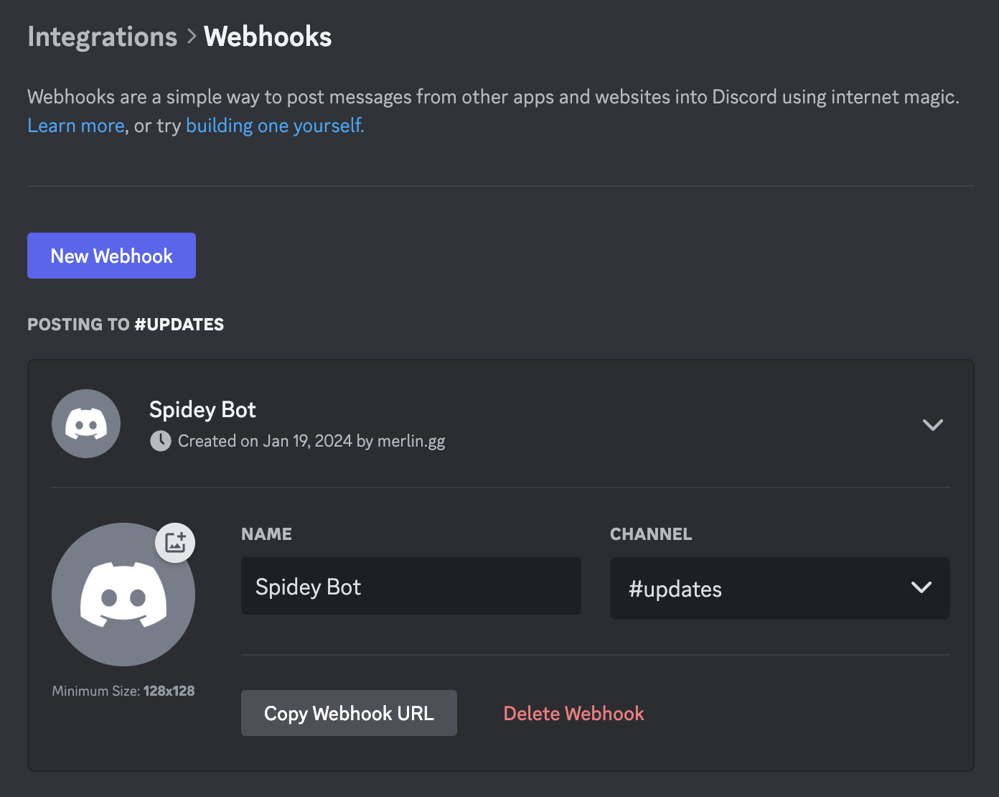
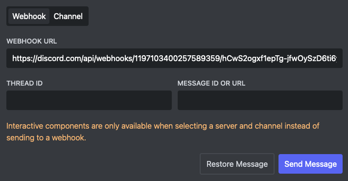
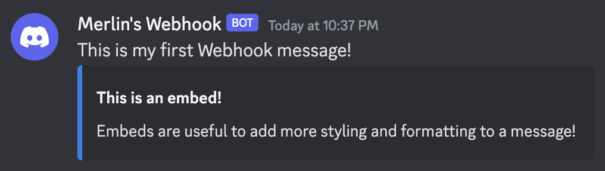

# Discord Webhook Sender

A Discord webhook is a URL that posts messages into one channel. Whoever has the URL can send to it without a bot or a Discord account, and every message can carry its own name and avatar. Embed Generator is a webhook sender with a visual editor: build the message, paste the webhook URL and click send.

**[Open the editor](https://message.style/app/editor)** to try it, or read on for the steps.

## Create a webhook in Discord

You need the **Manage Webhooks** permission in the channel.

1. Open the server settings, go to **Integrations** and click **Webhooks**. The same page is under **Integrations** in a channel's settings.
2. Click **New Webhook** and pick the channel it should post to.
3. Give it a name and avatar if you like. These are defaults, each message can override them.
4. Click **Copy Webhook URL**. It looks like `https://discord.com/api/webhooks/1197103400257589359/hCwS2ogxf1...`.



## Send a message to the webhook

1. Open the [editor](https://message.style/app/editor).
2. In the send menu, choose **Webhook** and paste the URL.
3. Write the message. Add embeds with a title, fields, images and a color, or build a [Components V2](/docs/features/components-v2) layout. Set a username and avatar at the top if this message should look different from the webhook's defaults.
4. Click **Send Message**.



The message shows up in the channel right away, with an **App** badge next to the name.



## Edit a message you already sent

Sending again always posts a new message. To change one that's already in the channel, right-click it in Discord, choose **Copy Message Link** and paste the link into **Message ID or URL**. **Restore Message** loads it back into the editor, and **Edit Message** replaces it with whatever is in the editor.

A webhook can only edit messages it sent itself.

## Send to a thread or forum post

Paste the thread's ID into **Thread ID**. To copy it, turn on **Developer Mode** under User Settings → Advanced, then right-click the thread and choose **Copy Thread ID**. In a forum channel this is how you post into an existing post.

## What a webhook message can contain

- Up to 2,000 characters of text
- Up to 10 embeds, with 6,000 characters across all of them
- Files and images
- Link buttons and Components V2 layouts

A webhook can only send. It can't read the channel, add reactions or send DMs, and it can't respond when someone clicks a button. Buttons that hand out roles, select menus and anything else that reacts to a click need a bot, because Discord delivers the click to the app that owns the message. For those, log in, add the Embed Generator bot to your server and send to a channel instead of a webhook. See [interactive components](/docs/guides/interactive-components).

## Send to a webhook from code

A webhook takes a JSON POST, so a script or CI job can use it directly:

```bash
curl -X POST "https://discord.com/api/webhooks/ID/TOKEN?wait=true" \
  -H "Content-Type: application/json" \
  -d '{
    "username": "Deploy Bot",
    "content": "Deploy finished",
    "embeds": [{ "title": "v2.4.1 is live", "color": 5763719 }]
  }'
```

With `wait=true` Discord answers with the created message, including the ID you need to edit it later with a `PATCH` to `/webhooks/ID/TOKEN/messages/MESSAGE_ID`. Without it the response is an empty 204.

To get the JSON for a message you designed, open **JSON Code** in the editor and copy it.

## If a webhook URL leaks

Anyone with the URL can post to the channel and delete the webhook. Discord has no way to reset the URL, so delete the webhook under **Integrations → Webhooks** and create a new one.

Found a webhook URL and don't know where it's from? The [Webhook Info tool](https://message.style/app/tools/webhook-info) shows its name, avatar, server and who created it.

## Fluxer webhooks

[Fluxer](https://fluxer.app) webhooks accept the same messages, so you can paste a Fluxer webhook URL into the editor too. Fluxer has no components or threads yet, see [Fluxer](/docs/features/fluxer) for what works there.
